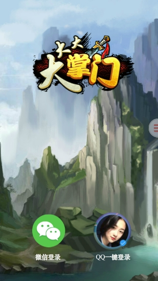
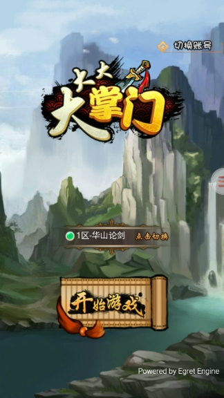

* nest [下载地址](https://github.com/egret-labs/Nest) 

	egret 引擎：下载完后按照 [第三方库接入流程](../../../extension/threes/instructions/README.md) 将Nest添加到项目中，path 指向到 ```nest/libsrc``` 下。

	非 egret 引擎：下载完后，请将 ```libsrc/bin/nest/nest.min.js``` 文件按普通 js 一样加入到项目中。

* 按钮资源
  
  可以使用 loginAssets 下默认的资源或者自行找对应的素材。
	
	
## 新版说明

```nest.easyuser.startup``` 代替老版本的 ```nest.core.startup```

```nest.easyuser.login``` 代替了老版本的 ```nest.user.checkLogin``` ```nest.user.isSupport```以及 ```nest.user.login```，登录只需要这个接口就可以。

```nest.easyuser.logout``` 代替老版本的 ```nest.user.logout```

```nest.easyuser.getInfo``` 代替老版本的 ```nest.user.getInfo```

```nest.easyuser.isSupport``` 简化成判断有没有 ```getInfo、logout``` 

## 流程

* nest.easyuser.startup 初始化 nest。

* nest.easyuser.getLoginTypes 获取当前平台有几种登录方式，如果有则需要在进入游戏登录页面前先显示带有登录按钮方式的界面，如果没有则直接调用 nest.easyuser.login 进入到游戏。

* nest.easyuser.login 如果有登录方式，则传入登录方式，如果没有，直接传入 {}

* [测试](#h5测试) 请完全按照下方的测试方式来。 

## api 参数说明

在 Nest 中，使用了传参并通过回调函数返回数据，这里通过 nest.easyuser.startup 来说明下各个参数的意思。

* nest.easyuser.startup(info:nest.core.StartupInfo, callback:(resultInfo:nest.core.ResultCallbackInfo)=>any)： 开发者调用的 api 方法。

* info:nest.core.StartupInfo：方法需要传入的参数，为 nest.core.StartupInfo 类型。

		由于在 Nest 中 nest.core.StartupInfo 被声明为一个接口（interface），因此大家不可以直接通过 new 的方式来创建 nest.core.StartupInfo 对象，其实只需要通过简单的 Object 对象赋值即可。比如这里可以直接通过赋值
		{"egretAppId": 88888, "version": 2}.

* callback:(resultInfo:nest.core.ResultCallbackInfo)=>any)：方法回调函数，一个拥有参数为 resultInfo:nest.core.LoginCallbackInfo 返回值为 any 的函数。

* 示例：
 
		var info:any = {};
		//设置游戏id。如果是通过开放平台接入，请在开放平台游戏信息-》基本信息-》游戏ID 找到。
		info.egretAppId = 88888;
		//设置使用 Nest 版本。请传递2
		info.version = 2;
		//在debug模式下，请求nest接口会有日志输出。建议调试时开启
		info.debug = true;
		nest.easyuser.startup(info, function (data) {
		    if(data.result == 0) {
		        //初始化成功，进入游戏
		    }
		    else {
		        //初始化失败，可能是url地址有问题，请联系官方解决
		    }
		})

## api 详解

### nest.easyuser.startup 初始化项目数据

``` 这个是其他 api 调用的前提，请确保首先调用此 api ```

* 参数说明

		info:nest.core.StartupInfo 初始化信息。比如 {"egretAppId" : 88888, "version" : 2}
		  |--- egretAppId 如果是通过开放平台接入，请在开放平台游戏信息-》基本信息-》游戏ID 找到。
		  |--- version 使用的Nest版本，请传递2

		callback:(resultInfo:ResultCallbackInfo)=>any。回调结果函数
			resultInfo：回调函数的参数数据
				|--- result 回调参数是否正确，0 正确，其他 错误

* 示例

		var info:any = {};
		//设置游戏id。如果是通过开放平台接入，请在开放平台游戏信息-》基本信息-》游戏ID 找到。
		info.egretAppId = 88888;
		//设置使用 Nest 版本。请传递2
		info.version = 2;
		//在debug模式下，请求nest接口会有日志输出。建议调试时开启
		info.debug = true;
		nest.easyuser.startup(info, function (data) {
		    if(data.result == 0) {
		        //初始化成功，进入游戏
		    }
		    else {
		        //初始化失败，可能是url地址有问题，请联系官方解决
		    }
		})

### nest.easyuser.getLoginTypes 获取当前平台有几种登录方式

有则需要在进入游戏登录页面前先显示带有登录按钮方式的界面；没有则直接调用 ```nest.easyuser.login``` 进入到游戏。如果调用登出api后，需要重新调用此api获取登录方式


* 示例

		var loginTypes:Array<nest.easyuser.ILoginType> = nest.easyuser.getLoginTypes();
		if (loginTypes.length) {//需要显示对应的登录按钮
			var typeInfo:nest.easyuser.ILoginType = loginTypes[0];
		    if (loginTypes.length == 1 && (typeInfo.loginType == "wx" || typeInfo.loginType == "qq")) {
		    	//直接调用 nest.easyuser.login，传入 typeInfo 即可。
		    }
		    else {
		        //按照获取到的类型，显示全部的按钮，其中，qq（qq对应按钮）、 wx（微信对应按钮）、default（游戏内自己进入按钮），请可能兼容多种按钮同时存在的页面
				//如果传入的参数带有 accInfo 信息，请根据 accInfo.avatarUrl 来显示头像，并修改名称为 XX一键登录。
				//按钮点击后，请调用 nest.easyuser.login，并传入对应的登录类型
			
		    }

		}
		else {//直接调用 nest.easyuser.login，传入 {} 即可。
			
		}

	 

> 第二个图为游戏内第一个页面，第一个图为平台登录需求的页面，需要是全屏页面显示而不是简单的弹窗。

### nest.easyuser.login 登录

```请确保已经调用过  nest.easyuser.startup ```，并且需要调用根据 ```nest.easyuser.getLoginTypes();``` 来传入相应的参数。登录 api 的处理需要在进入游戏自己的第一页面前处理完（比如游戏默认的登录页面）。

* 参数说明
		
		loginInfo: nest.user.LoginInfo 登录传入的类型方式。 如果没有获取到登录类型，请传递 {}
		
		callback:(resultInfo: nest.user.LoginCallbackInfo)=>void 回调结果函数
			resultInfo：登录获取到的信息，根据 resultInfo.result == 0 来判断是否登录成功

* 示例

		nest.easyuser.login({}, function (resultInfo:nest.user.LoginCallbackInfo) {
		    if (resultInfo.result == 0) {//登录成功
				
			}
			else if (resultInfo.result == -3) {//平台登陆账号被踢掉，需要重新登陆
			
			}
			else {//登录失败
				
			}
		})

### nest.easyuser.isSupport 检测api是否支持

* 参数说明
		
		info:Object 请传递 {}
		
		callback:(resultInfo:nest.easyuser.UserSupportCallbackInfo)=>void 回调结果函数
			getInfo：获取渠道是否支持获得用户信息接口，1是支持，其他不支持。如果支持可以使用nest.easyuser.getInfo获取用户信息
			logout：获取渠道是否登出接口，1是支持，其他或者不存在都属于不支持。如果支持可以使用nest.easyuser.logout 

* 示例

		nest.easyuser.isSupport({}, function (data:nest.easyuser.UserSupportCallbackInfo) {
		    //获取是否支持nest.user.getInfo接口，有该字段并且该字段值为1表示支持
		    var getInfo = data.getInfo;
		    var logout = data.logout;
		})

### nest.easyuser.getInfo 获取用户信息，目前只有qq浏览器支持

```调用前，请确保 nest.easyuser.isSupport 返回结果支持调用```

* 参数说明

		loginInfo:nest.user.LoginInfo 请传入 {}

		callback:(resultInfo:Object)=>any 回调结果函数
			resultInfo：回调函数的参数数据

* 示例

		nest.easyuser.getInfo({}, function (data) {
		    if(data.result == 0) {
		        //获取用户信息成功
		         var msg = data.msg;              //传回的提示信息
		         var nickName = data.nickName;    //昵称
		         var avatarUrl = data.avatarUrl;  //头像
		         var sex = data.sex;              //性别, 0未知，1男，2女
		         var city = data.city;            //城市
		         var language = data.language;    //语言
		         var isVip = data.isVip;          //是否vip, 1是，0不是
		         var province = data.province;    //省份
		         var country = data.country;      //国家
		    }
			else if (data.result == -3) {//平台登陆账号被踢掉，需要重新登陆
			
			}
		    else {
		         //获取用户信息失败
		    }
		})


### nest.easyuser.logout 登出
* 参数说明

		loginInfo:nest.user.LoginInfo 请传入 {}

		callback:(resultInfo:nest.core.ResultCallbackInfo)=>any。回调结果函数
			resultInfo：回调函数的参数数据
				|--- result 回调参数是否正确，0 正确，其他 错误

* 示例

		nest.easyuser.logout({}, function (resultInfo:nest.core.ResultCallbackInfo) {
		    if (resultInfo.result == 0) {
		    	//登出成功，再次登录请使用直接按之前的登录方式登录 nest.easyuser.login
        		
		    }
			else if (resultInfo.result == -3) {//平台登陆账号被踢掉，需要重新登陆
			
			}
		    else {
		        //登出失败，有可能是该平台不支持登出接口
		    }
		});
		
### nest.core.addCallback 添加runtime事件回调


* 参数说明

		callback:(callbackInfo:nest.core.CallbackInfo)=>void。回调函数
			callbackInfo：回调函数的参数数据
				|--- loginState 登录状态发生改变，1表示已登录，2表示未登录

* 示例

		nest.core.addCallback(function (callbackInfo:nest.core.CallbackInfo) {
		    if (callbackInfo.loginState) {
		    	//登录状态发生改变，1表示已登录，2表示未登录
		    }
		});

### nest.iap.pay 支付
* 参数说明

		orderInfo:nest.iap.PayInfo 支付信息
				|--- goodsId 配置id
				|--- goodsNumber 购买数量
				|--- serverId 哪个服
				|--- ext

		callback:(resultInfo:ResultCallbackInfo)=>any。回调结果函数
			resultInfo：回调函数的参数数据
				|--- result 回调参数是否正确，0 正确，其他 错误

* 示例

		var info = {};
		//购买物品id，在开放平台配置的物品id
		info.goodsId = "1";
		//购买数量，当前默认传1，暂不支持其他值
		info.goodsNumber = "1";
		//所在服
		info.serverId = "1";
		//透传参数
		info.ext = "xx";
		nest.iap.pay(info, function (data) {
		     if(data.result == 0) {
		         //支付成功
		     }
		     else if(data.result == -1) {
		         //支付取消
		    }
			else if (data.result == -3) {//平台登陆账号被踢掉，需要重新登陆
			
			}
		    else {
		        //支付失败
		    }
		})


### nest.share.isSupport 是否支持分享
* 示例

		nest.share.isSupport({}, function (data) {
		    //获取是否支持nest.share.share接口，有该字段并且该字段值为1表示支持
		    var share = data.share;
		})
	
### nest.share.setDefaultData 设置默认分享信息接口


* 示例

		var info:any = {};
		//分享标题
		info.title = "title";
		//分享文字内容
		info.description = "descriscription";
		//分享链接
		info.url = "http://url";
		//分享图片URL
		info.image_url = "http://imageUrl";
		//分享图片title
		info.image_title = "image_title";
		nest.share.setDefaultData(info, function (data) {
		    if(data.result == 0) {
		        //设置成功
		    }
			else if (data.result == -3) {//平台登陆账号被踢掉，需要重新登陆
			
			}
		    else {
		        //设置失败
		    }
		})
		
### nest.share.share 分享

```调用此接口前请先使用 nest.share.isSupport 判断是否支持该功能```

* 示例

			var info:any = {};
		//分享标题
		info.title = "title";
		//分享文字内容
		info.description = "descriscription";
		//分享链接
		info.url = "http://url";
		//分享图片URL
		info.imageUrl = "http://imageUrl";
		nest.share.share(info, function (data) {
		    if(data.result == 0) {
		        //分享成功
		    }
		    else if(data.result == -1) {
		        //分享取消
		    }
			else if (data.result == -3) {//平台登陆账号被踢掉，需要重新登陆
			
			}
		    else {
		        //分享失败
		    }
		})	


### nest.social.isSupport 社交相关支持

* 示例

		nest.social.isSupport({}, function (data) {
		    //获取是否支持nest.social.openBBS接口，有该字段并且该字段值为1表示支持
		    var openBBS = data.openBBS;
		    var getFriends = data.getFriends;
		})
		
		
### nest.social.getFriends 获取好友列表

```调用此接口前请先使用 nest.social.isSupport 判断是否支持该功能```

* 示例

		
### nest.social.openBBS 打开论坛

```调用此接口前请先使用 nest.social.isSupport 判断是否支持该功能```

* 示例

		nest.social.openBBS({}, function (data) {
		    if(data.result == 0) {
		        //打开成功
		    }
			else if (data.result == -3) {//平台登陆账号被踢掉，需要重新登陆
			
			}
		    else {
		        //打开失败
		    }
		})

### nest.app.isSupport 是否支持特定功能

* 示例

		nest.app.isSupport({}, function (data) {
		    //获取是否支持 nest.app.attention 接口，有该字段并且该字段值为1表示支持，0表示不支持，2表示已关注
		    //已关注的信息在某些平台可能获取不到，请不要过渡依赖该信息，如果游戏有首次关注奖励可以自行在后台存储
		    var attention = data.attention;
		    //获取是否支持nest.app.exitGame接口，有该字段并且该字段值为1表示支持
		    var exitGame = data.exitGame;
		    //获取是否支持nest.app.sendToDesktop接口，有该字段并且该字段值为1表示支持
		    var sendToDesktop = data.sendToDesktop;
		    //获取是否支持nest.app.getInfo接口，有该字段并且该字段值为1表示支持
		    var getInfo = data.getInfo;
		})
		
		
### nest.app.attention 关注

```调用此接口前请先使用 nest.app.isSupport 判断是否支持该功能```

* 示例

		nest.app.attention({}, function (data) {
		    if(data.result == 0) {
		        //关注成功
		    }
		    else if(data.result == -1) {
		        //关注取消
		     }
			else if (data.result == -3) {//平台登陆账号被踢掉，需要重新登陆
			
			}
		    else {
		        //关注失败
		    }
		})
				
### nest.app.exitGame 退出游戏，回到 App 界面

```调用此接口前请先使用 nest.app.isSupport 判断是否支持该功能```

* 示例

		nest.app.exitGame({}, function (data) {
		    if(data.result == 0) {
		        //退出成功
		    }
		    else {
		        //退出失败
		    }
		})
				
### nest.app.sendToDesktop 发送到桌面

```调用此接口前请先使用 nest.app.isSupport 判断是否支持该功能```

* 示例

		nest.app.sendToDesktop({}, function (data) {
		    if(data.result == 0) {
		        //保存成功
		    }
			else if (data.result == -3) {//平台登陆账号被踢掉，需要重新登陆
			
			}
		    else {
		        //保存失败
		    }
		})
		
### nest.app.getInfo 获取客服信息

```调用此接口前请先使用 nest.app.isSupport 判断是否支持该功能```

* 示例

		nest.app.getInfo({}, function (data) {
		    if(data.result == 0) {
		        //获取成功
		        //获取联系方式
		        var contact = data.contact;
		        //获取qq联系方式，没有该字段表示没有可用的qq联系方式，请到开放平台进行配置。该字段为一个数组
		        var qq = contact.qq;
		        //获取qq群联系方式，没有该字段表示没有可用的qq群联系方式，请到开放平台进行配置。该字段为一个数组
		        var qqgroup = contact.qqgroup;
		        //获取微信联系方式，没有该字段表示没有可用的微信联系方式，请到开放平台进行配置。该字段为一个数组
		        var weixin = contact.weixin;
		        //获取邮件联系方式，没有该字段表示没有可用的邮件联系方式，请到开放平台进行配置。该字段为一个数组
		        var email = contact.email;
		    }
		    else {
		        //获取失败
		    }
		})


## 本地测试 （使用测试gameId 88888 测试）


### h5测试

* 步骤

	1、在开放平台注册游戏，获取游戏appId。在 游戏信息-》基本信息-》游戏ID 中找到。

	2、打开游戏地址，比如 `http://localhost:63342/HelloGUI/launcher/index.html`

	3、在游戏地址后面加入平台测试需要的参数（如下），`请务必加上，并且务必把下面 2 处 my_appId 换成自己的 appId，否则测试不会通过`
platInfo=open\_```my_appId```_9166&egret.runtime.spid=9166&appId=```my_appId```&channelId=9166&egretSdkDomain=http://api.egret-labs.org/v2&egretServerDomain=http://api.egret-labs.org/v2

	4、弹出登录窗之后请选择`其他方式登陆`，用户名：```guest1```到```guest8```，密码：```123456```。qq、微博暂不可以测试。


* 下面以游戏appId `88888` 为例代替上面参数中的 `my_appId`，最后测试的网址应该是（如果有跳转，请务必把参数也一起加上，一句话，最终的游戏运行的地址中必须要看到有上面的参数）

	http://localhost:63342/HelloGUI/launcher/index.html?platInfo=open\_88888_9166&egret.runtime.spid=9166&appId=88888&channelId=9166&egretSdkDomain=http://api.egret-labs.org/v2&egretServerDomain=http://api.egret-labs.org/v2


### runtime

* runtime目前只支持android系统。

* 下载 egret runtime 的测试包  http://arena.egret.com/Egret_Guidance/EgretRuntimeCheck.zip

* 提供一个可以返回类似如下数据的地址（即 runtime 测试地址）比如 http://pay.csgj.egret-labs.org:12000/main.php。

~~~
 {
	 //游戏代码包路径
	 "code_url":"http://your-cdn-domain/game/version_1/game_code.zip",
	 //游戏资源前缀路径
	 "update_url":"http://your-cdn-domain/game/version_1/",
	 //游戏参数
	 "customParams":
	 {
	 }
 }
 ~~~

* 用软件扫码扫描上述地址，测试 game id  88888，点击启动游戏即可

## 注意
* 请先使用nest.easyuser.startup初始化Nest
* runtime目前只支持android系统。
* 具体测试 demo 请参考 demo2.
