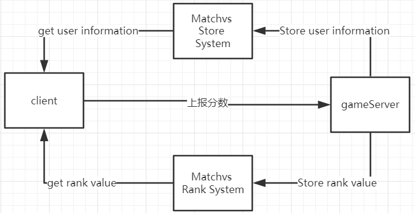

# Matchvs-Poker

在阅读此案例之前，需要熟悉 Matchvs SDK 的使用和了解 gameServer 的使用。

## 概述

Matchvs Poker  是一款比较流行的的斗地主游戏主要功能如下：

- 实现了最经典的斗地主玩法，叫地主抢地主等功能。
- 支持随机匹配模式，主动创建房间邀请微信好友模式两种。
- 接入Matchvs独立的排行榜系统。

分为客户端和服务端两个部分，client 是使用 Egret 实现的，server 是使用 matchvs gameServer nodejs版实现。项目目录结构如下：

```
┌-client Egret实现的客户端代码
├-gs-server Matchvs gameServer nodejs 实现的服务端代码
├-matchvs Matchvs客户端SDK
├-wxshare 封装的微信小游戏接口
└-README
```


## 排行榜实现

Poker 排行榜实现方法如下： 



client 上报分数到 gameServer，gameServer 再将分数上报给 Matchvs Rank System，Rank System 是通过gameID 和 userID 来计算用户排行数据，并不关心用户的 nickname 、avatar 等信息。 所以需要将 user information 另外的使用Matchvs Store System 存储系统保存。

### 接入描述

接入排行榜之前，可以先看看 [Matchvs Rank System API Doc]() 描述了所有可使用的排行接口。gs-server 中主要使用到了 创建排行榜、上报分数、查询指定用户排行信息接口。

gs-server 使用的 axios 框架做 http 请求。在代码中有做好了排行榜接口的封装工作。在 `gs-server/src` 目录下可看到如下两个文件：

- gs-server/src/HttpRequest.js：对 axios 接口再次封装，使用 get、post、put、delete 等请求函数明确了Restful 接口请求方式。因为 Matchvs Rank API 严格按照 Restful 模式设置的。
- gs-server/src/ReportDataNew.js：排行榜数据上报接口，是对Matchvs Rank API 请求接口的封装, 把http 请求和 sign 签名都实现好了，只需要传入相应的参数即可。

### 排行榜接口 host 和 path 

接口地址和对应请求 path 定义在 ReportDataNew.js 中，这个列出部分代码：

```javascript
const rank_host         = (GameData.Conf.DATA_STORAGE_ENV == 1 ? GameData.HttpApi.RELEASE_HOST : GameData.HttpApi.ALPHA_HOST); // 排行榜接口地址
const rank_config       = "/rank/ranking_list_configs?";    // 排行榜配置
const rank_score        = "/rank/scores?";                  // 上传排行榜分数
const rank_snapshot     = "/rank/snapshot?";                // 创建排行榜快照
const rank_grades       = "/rank/grades?";                  // 查询用户排行
const rank_list         = "/rank/ranking_list?";            // 排版列表
const rank_delete = "/rank/ranking_list_configs?";			// 删除排行
```

### 创建排行榜

在 ReportDataNew.js 可以看到 CreatorRankConfig 函数，这个函数是请求 Matchvs Rank System 创建一个排行榜。该排行榜参数由用户设置，设置参数可参考 this.rankconfig 变量值:

```javascript
class ReportDataNew{
    ......
    constructor(){
        this.rankconfig = {
            gameID: this.gameID,
            rankinglistName: "totlal_rank",
            rankGist: "score",
            sortOrder: 0,
            updatePeriodType: 3,
            customStartTime: 0,
            customPeriod: 0,
            rankNum: 100,
            historyPeriodNum: 0,
            updateRuleType: 2,
            sign: "xxx",
            userID: 0,
        };
    }
    /**
     * 创建排行榜
     * @param {Function} callback 回调函数
     */
    CreatorRankConfig(callback){
        this.rankconfig["seq"] = this.getSequence();
        this.rankconfig["ts"]= this.getTimeStamp();
        this.rankconfig.sign = this.SignParse(this.rankconfig, ["gameID"]);
        http.post(httpReq.url_Join(rank_host, rank_config), this.rankconfig, callback);
    }
	......
}
```

在 gs-server 启动的时候调用 `CreatorRankConfig` 函数创建一个排行榜，如果排行榜已被创建，接口会返回错误提示（排行榜已存在），我们不用关心这个返回值, 如下代码：

```javascript
// main.js
let report = new ReportDataNew();
report.CreatorRankConfig();
```


### 上报排行榜

client 打完一局，再离开房间之前需要 调用 MatchvsSDK sendEventEx 接口上报分数和用户信息到 gs-server 中。然后gs-server 把用户信息和分数分别存储到 Matchvs Store System 和 Matchvs Rank System。在 ReportDataNew.js 文件可以看到以下几个函数：

```javascript
	/**
     * 上传分数,把玩家分数上报到 Matchvs Rank System
     * @param {object} args 请求参数 {userID:1,value:0}
     * @param {Function} callback 回调函数
     */
    UpdateScores(args, callback){
        let data = {
            userID:args.userID,
            gameID:this.gameID,
            sign:"",
            items:[
                {fieldName:this.rankconfig.rankGist, value:args.value}
            ],
            mode:2,
            seq:this.getSequence(),
            ts:this.getTimeStamp()
        };
        data.sign = this.SignParse(data, ["gameID","userID"]);
        let userid = args.userID;
        console.log("上报数据参数：", JSON.stringify(data));
        http.put(httpReq.url_Join(rank_host, rank_score) , data, callback);
    }

    /**
     * 从 Matchvs Rank System 获取用户当前的排行数据
     * @param {object} args {userID:,}
     * @param {Function} callback 
     */
    GetUserRank(args, callback){
        let grades = {
            userID: args.userID,
            gameID: this.gameID,
            type: 0,                 // 类型，取值0或者1，0排行榜，1快照
            rankName: this.rankconfig.rankinglistName,//排行榜名称
            snapshotName: "",        //快照名称
            rank: 0,                 //范围
            period: 0,               //周期，取值0或1，0当前周期，1上一周期
            sing: "",                //签名
            mode:2,
            seq: this.getSequence(),
            ts: this.getTimeStamp()
        }
        grades.sign = this.SignParse(grades, ["gameID", "userID"]);
        let param = this.paramsParse(grades);
        http.get(httpReq.url_Join(rank_host, rank_grades) + param, callback);
    }
    /**
     * 保存用户信息
     * @param {number} userID
     * @param {Array<object>} userInfo [{userID:123, name:'', avatar:''}]
     * @param {Function} callback 
     */
    RecordUserListInfo(userID , InfoList , callback){
        let listInfo =[];
        InfoList.forEach(user=>{
            listInfo.push({
                key: user.userID,
                value: this.base64Encode(JSON.stringify({ name: user.name, avatar: user.avatar })),
            });
        });

        let data = {
            gameID   : this.gameID,
            userID   : userID, 
            dataList : listInfo,
            sign     : "",
            mode:2,
            seq: this.getSequence(),
            ts: this.getTimeStamp()
        }

        data.sign = this.SignParse(data, ["gameID","userID"]);
        let param = this.paramsParse(data);
        http.get(httpReq.url_Join(rank_host, GameData.HttpApi.SET_GAMEDATA) + param, callback);
    }
```

在 Room.js 函数 roomEvent 收到玩家上报分数指令，然后调用 Player.js 中的 reportGameScoreNew ，分别数处理相关的数据。

```javascript
//Room.js
	/**
     * 收到上报分数的消息调用上报分数模块接口
     * @param {number} userID 上报的玩家ID
     * @param {number} dt 上报的数据
     */
    reportPlayerScore(userID, dt){
        //房间上报数据状态
        this.roomState |= ROOMSTATE.GAME_REPORT;
        let player = this.players.get(userID);
        let event = {
            action: GameData.RSP_EVENT.REPROT_RESULT,
            data:{
                userID:userID,
                status:1,
                rank:0,
                totleScore:0,
            }
        };
        let self  = this;
        if(player){
            log.debug("userID:"+userID+" data:",dt);
            // 这里调用 Player.js 分别处理上报数据
            player.reportGameScoreNew(dt, function(res, err){
                if(res !== null){
                    log.info("上报成功：", res);
                    event.data.rank = res.data.rank;
                    event.data.totleScore = res.data.value;
                    event.data.status = 0;
                    self.reInitRoom(); 
                    self.sendEvent(event);
                }else{
                    log.error("report data error ", JSON.stringify(err));
                    self.sendEvent(event);
                }
            });
        }else{
            log.error("This userID is invaild");
            self.sendEvent(event);
        }
    }

// Player.js
	/**
     * 上报分数新接口，不用在 gameServer 自己排行，借助独立的排行榜系统排序。
     * @param {*} data 分数 {times:1,model:1,value:19}
     * @param {*} _callback 结果回调函数 (res, err)=>{}
     */
    reportGameScoreNew(data, _callback){
        let score = data.value;
        if ("avator" in data) {
            this.avator = data.avator;
        }
        if ("name" in data) {
            this.nickName = data.name + "";
        }
        let report_new = new ReportDataNew();
		//先 上报数据到 Matchvs Rank System
        report_new.UpdateScores({userID:this.userID, value: score}, (res, err)=>{
            if (err) {
                _callback(null, err);
                return;
            }
            // 上报分数成功后，上传用户昵称和头像信息
            report_new.RecordUserListInfo(this.userID, [
                { userID: this.userID, name: this.nickName || "", avatar: this.avator || "" },
            ], (res, err) =>{
                if (err){
                    log.error("用户信息上传失败：", err);
                }
            });

            //获取用户当前排行数据，返回给我客户端
            let grades = {
                userID: this.userID
            }
            report_new.GetUserRank(grades, (res, err) => {
                if(err){
                    _callback(null, err);
                    return;
                }
                _callback(res, null);
            });
        });
    }

```

### client 获取排行榜列表

gs-server 上报的数据，会根据创建排行榜设置的信息对数据进行排行，可以在客户端获取排行榜数据。因为在排行榜系统中只能获取到 userID 列表，需要在客户端展示用户的头像，昵称等信息需要到存储系统中获取，存储系统中的用户信息是在 gs-server 上报的。

获取排行榜列表数据我们可以看 client/src/matchvs/MvsHttpApi.ts 中的 `GetRankListData` 接口

```typescript
public GetRankListData(callback){
    let params = {
            pageMax:10,
            period:0,
            rankName:"totlal_rank",
            self:0,
            top: 50,
            userID: this.userID|| 0,
            gameID: this.userID,
            pageIndex:1,
            mode:1,
            seq: this.getCounter(),
            ts:this.getTimeStamp(),
        }
        params["sign"] = this.SignPoint(params,["gameID","userID"]);
        let param = MvsHttpApi.paramsParse(params);
	this.http_get(MvsHttpApi.url_Join(this.open_host,this.rank_list)+param,callback);
}
```

在 RankList.js 中调用 GetRankListData 接口获取排行榜数据，然后取出获取到的 userID list 去Matchvs Store System 获取对应的 nickname 和 avatar 。如 scr/scene/RankList.js 中的 RankListRsp 和 client/src/matchvs/MvsHttpApi.ts 中的 GetUserInfoList

```typescript
	//  scr/scene/RankList.js
	/**
	 * 获取排行榜列表回调
	 */
	public RankListRsp(res, err){
		console.log("请求的数据为：",res);
		if(res && res.statusCode == 200){
			let data:Array<any> = res.data;
			let userList:Array<any> = [];
			for(var i= 0; i < data.length; i++){
				let obj = {
					ranking: data[i].rank + "", 
					name: data[i].userID, 
					score: data[i].value ,
					head:"http://alphazwimg.matchvs.com/egret/Three-Poker/img/images2.jpg"
				};
				this.dsListHeros.push(obj);
				userList.push(data[i].userID);
			}
			this.http.GetUserInfoList(userList,this.getUserInfoListRsp.bind(this));
		}else{
			console.log("请求错误：", err);
		}
	}
	
// client/src/matchvs/MvsHttpApi.ts 
	/**
     * 获取保存在全局 http 接口列表的用户信息
     */
    public GetUserInfoList(list:Array<any>,callback:Function){
        let keyList = [];
        list.forEach(k=>{
            keyList.push({key:k});
        });
        let data = {
            gameID   : this.gameID,
            userID   : this.userID || 0,
            keyList  : keyList,
            mode:2,
            sign : "",
            seq: this.getCounter(),
            ts:this.getTimeStamp(),
        }
        data.sign = this.SignPoint(data,["gameID","userID"]);
        let param = MvsHttpApi.paramsParse(data);
		this.http_get(MvsHttpApi.url_Join(this.open_host, this.get_game_data)+param, callback);
    }
```

### 获取玩家当前分数

玩家登陆游戏进入到游戏首页，在右上角显示用户打完一局后剩下的分数，这个分数需要在 排行榜系统中获取。在 Main.js 中的 getUserPointValueNew 函数调用 MvsHttpApi.js 的 GetUserRank 函数获取用户分数，

```typescript
// MvsHttpApi.js
public GetUserRank(userID, callback){
        let grades = {
            userID: userID,
            gameID: this.gameID,
            type: 0,                 // 类型，取值0或者1，0排行榜，1快照
            rankName: "totlal_rank", //排行榜名称
            rank: 0,                 //范围
            period: 0,               //周期，取值0或1，0当前周期，1上一周期
            mode:1,
            seq: this.getCounter(),
            ts : this.getTimeStamp(),
        }
        grades["sign"] = this.SignPoint(grades, ["gameID","userID"]);
        let param = MvsHttpApi.paramsParse(grades);
		this.http_get(MvsHttpApi.url_Join(this.open_host, this.rank_user)+param,callback);
    }
```

### 排行榜接入总结

在接入排行榜的过程中，主要就是对 http 接口的调用，开发者只需要关心游戏数据的上报和 http 接口的请求，不要关心排行是怎么计算的。整个过程就是对接口的操作，组数据，解析数据等等。我们这里例子是在 gs-server 中上报分数到 Matchvs Rank System 中的，当然也可以在客户端自己上报分数。但是在 gameServer 中上报分数是相对更安全一些。

## 发布说明

集成 Matchvs SDK 的程序支持发布 web ， 微信， QQ玩一玩，native平台。发布相应的平台不用做额外的适配，可以直接按照Egret 的发布教程即可。


