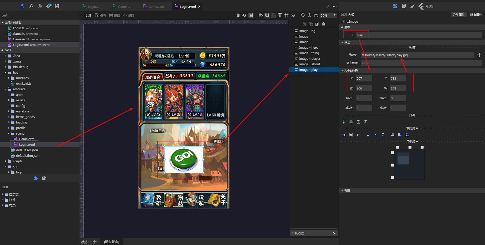

##  简介
轻度封装Egret游戏开发引擎,提供 XML-Activity->Logic 的工作流,使之贴近Android开发者的习惯,并可同时用于开发App&Game.
## 特性


1.提供xml的可视化UI编程




2.提供场景切换管理.
```
class Game extends eui.Component implements eui.UIComponent {
	public constructor() {
		super();
	}

	protected partAdded(partName: string, instance: any): void {
		super.partAdded(partName, instance);
		instance.addEventListener(egret.TouchEvent.TOUCH_TAP, function (e: egret.TouchEvent) {
			Toast.launch("click:" + partName);
			if (partName == "back") {
				SceneManager.back();
			} else if (partName == "bg") {
				SceneManager.showScene(new Game());
			}

		}, this);
	}


	protected childrenCreated(): void {
		super.childrenCreated();
	}

}
```

3. 提供屏幕适配,和Toast之类的UI组件

